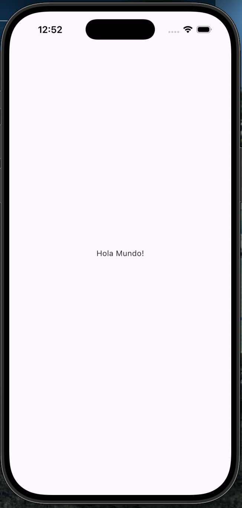

# Flutter Hello World App

Este proyecto es mi primera aplicación en Flutter, creada como introducción al framework.

## Descripción general

El objetivo de esta aplicación es comprender la estructura básica de un proyecto Flutter y cómo se construye una interfaz sencilla utilizando widgets.

La aplicación muestra un texto centrado en pantalla utilizando los componentes básicos de Flutter.

## Captura de pantalla

  

## Conceptos clave

- main() como punto de entrada de la aplicación  
- runApp() para inicializar el árbol de widgets  
- StatelessWidget como estructura base  
- MaterialApp para la configuración básica de la app  
- Scaffold como estructura principal de layout  
- Widgets Center y Text para construir la interfaz  

## Objetivo

Este proyecto marca la transición desde el aprendizaje de Dart hacia el desarrollo con Flutter.

El enfoque está en comprender cómo se estructuran las aplicaciones en Flutter y cómo se utilizan los widgets para construir interfaces.

