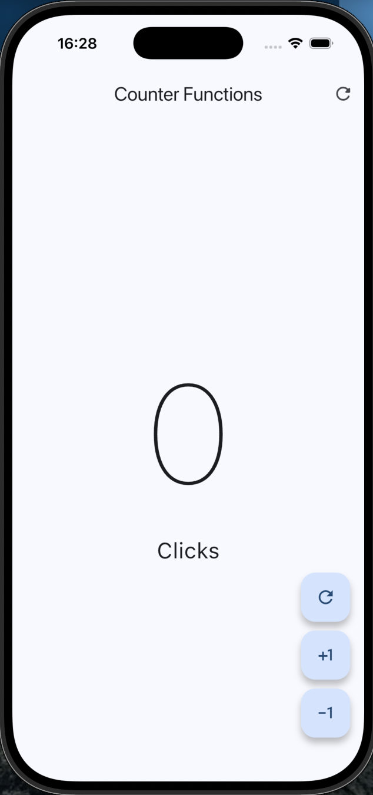

# Flutter Counter App

This project is a simple Flutter application that implements a counter with basic logic and UI interaction.

## Overview

The application allows the user to increment and decrement a counter value, with specific constraints and dynamic behavior:

- The counter cannot go below 0  
- When the counter reaches 1, the displayed label changes dynamically  

This project is focused on understanding state management and user interaction in Flutter.

## Screenshot

  

## Key Concepts

- StatefulWidget for managing dynamic state  
- Updating UI based on state changes  
- Handling user input through buttons  
- Conditional rendering based on counter value  
- Basic business logic implementation  

## Features

- Increment counter  
- Decrement counter (with lower limit at 0)  
- Dynamic label change when counter equals 1  

## Tech Stack

- Flutter  
- Dart  

## Purpose

This project builds upon the basics of Flutter by introducing stateful widgets and simple application logic.

The focus is on understanding how user interactions affect the UI and how to control application state.

