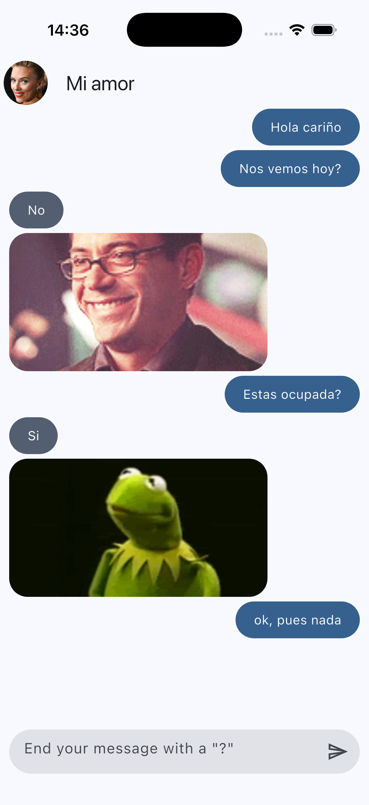

# Maybe App

This project is a Flutter chat application that simulates a conversation and provides automatic yes/no answers when the user sends a question.

## Overview

The application allows the user to write messages in a chat interface. When a message ends with a question mark, the app fetches an automatic response from an external API and displays it as a reply.

The response includes:

- A yes/no answer
- An animated image related to the answer
- A chat bubble styled as the other person's message

This project is focused on understanding state management, API consumption, model mapping, and dynamic UI updates in Flutter.

## Screenshot

  

## Key Concepts

- Provider for state management
- ChangeNotifier to update the UI
- Dio for HTTP requests
- Mapping JSON responses into Dart models
- Entity and model separation
- Conditional logic based on user input
- Dynamic chat UI using ListView.builder
- ScrollController for automatic chat scrolling
- Image loading from network URLs

## Features

- Send messages through a text field
- Display messages in different bubbles depending on who sent them
- Trigger automatic replies when the message ends with a question mark
- Fetch yes/no answers from an external API
- Show an image with each automatic reply
- Automatically scroll to the latest message
- Custom Material 3 theme

## Tech Stack

- Flutter
- Dart
- Provider
- Dio

## Purpose

This project builds upon previous Flutter exercises by introducing a more complete app structure and asynchronous data fetching.

The focus is on connecting the UI with application state, consuming an external service, and transforming API data into usable entities for the presentation layer.

## Navigation

- [Back to the repository overview](../../README_en.md)
