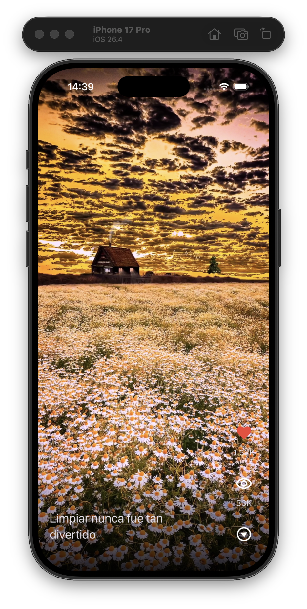

# Tok Tik

Este proyecto es una aplicación en Flutter inspirada en TikTok. Muestra un feed vertical de videos cortos con botones de interacción para likes, vistas y reproducción.

## Descripción

La aplicación carga una lista local de publicaciones de video y las presenta en una experiencia de pantalla completa. Cada video se muestra dentro de un `PageView` vertical, permitiendo al usuario desplazarse entre publicaciones como en un feed de videos cortos.

Cada publicación incluye:

- Un video local desde assets
- Un texto descriptivo
- Un contador de likes
- Un contador de vistas
- Botones de acción animados

Este proyecto está enfocado en entender la reproducción de video, el uso de assets locales, la gestión de estado, el mapeo de modelos y la composición de interfaces de pantalla completa en Flutter.

## Captura

  

## Conceptos clave

- Provider para la gestión de estado
- ChangeNotifier para actualizar la interfaz
- Videos locales como assets en Flutter
- Reproducción de video con video_player
- Mapeo de datos locales a modelos de Dart
- Separación entre entidades y modelos
- Navegación vertical usando PageView.builder
- Interfaces de pantalla completa con Stack y Positioned
- Formateo de números con intl
- Animaciones simples con animate_do
- Tema oscuro personalizado con Material 3

## Funcionalidades

- Mostrar un feed de videos cortos
- Desplazarse verticalmente entre videos
- Reproducir videos locales en pantalla completa
- Repetir los videos automáticamente
- Silenciar los videos por defecto
- Mostrar likes y vistas de cada publicación
- Formatear números grandes en valores legibles
- Mostrar botones de acción animados
- Cargar los datos de videos mediante un Provider
- Tema oscuro personalizado con Material 3

## Tecnologías

- Flutter
- Dart
- Provider
- video_player
- animate_do
- intl

## Propósito

Este proyecto amplía ejercicios anteriores de Flutter introduciendo una aplicación más visual y centrada en contenido multimedia.

El objetivo es conectar datos locales con la capa de presentación, gestionar el estado con Provider, reproducir videos locales y construir una experiencia móvil de pantalla completa similar a las aplicaciones modernas de videos cortos.
