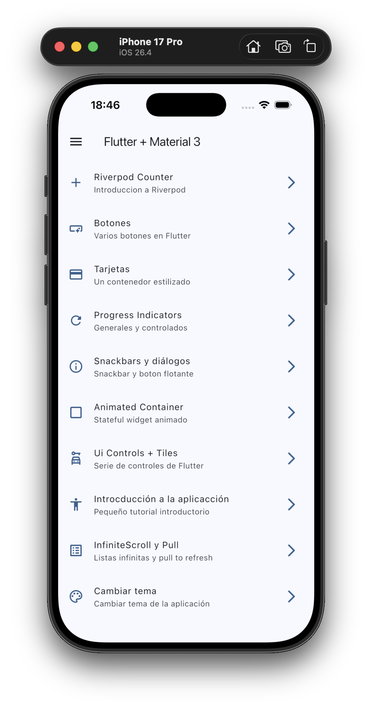

# Widget App

Aplicacion de practica creada con Flutter para probar muchos de los widgets, patrones y herramientas mas habituales del framework. El proyecto funciona como una pequeña galeria interactiva: desde la pantalla principal se accede a distintas secciones donde se prueban botones, tarjetas, indicadores de progreso, snackbars, dialogos, animaciones, controles de formulario, tutoriales, scroll infinito, Riverpod y cambio de tema.

El objetivo principal no es construir una app de produccion, sino tener un laboratorio ordenado para aprender como se comportan diferentes piezas de Flutter y Material 3.

## Demo

<p align="center">
  <a href="https://raw.githubusercontent.com/RaulEstevezA/FlutterExercises/main/flutter_first_steps/05_widget_app/demo.mp4">
    
  </a>
</p>

## Tecnologias usadas

- Flutter con Material 3.
- Dart.
- `go_router` para la navegacion declarativa.
- `flutter_riverpod` para manejo de estado.
- `animate_do` para animaciones sencillas.
- Assets locales en `assets/images/`.
- Imagenes remotas de `picsum.photos` para ejemplos visuales.

## Estructura general

```text
lib/
├── config/
│   ├── menu/
│   │   └── menu_items.dart
│   ├── router/
│   │   └── app_router.dart
│   └── theme/
│       └── app_theme.dart
├── presentation/
│   ├── providers/
│   │   ├── counter_provider.dart
│   │   └── theme_provider.dart
│   ├── screens/
│   │   ├── animated/
│   │   ├── app_tutorial/
│   │   ├── bottons/
│   │   ├── cards/
│   │   ├── counter/
│   │   ├── home/
│   │   ├── infinite_scroll/
│   │   ├── progress/
│   │   ├── snackbar/
│   │   ├── theme_changer/
│   │   ├── ui_controls/
│   │   └── screens.dart
│   └── widgets/
│       └── side_menu.dart
└── main.dart
```

La aplicacion esta separada en tres ideas principales:

- `config`: configuracion compartida de rutas, menu y tema.
- `presentation`: pantallas, widgets reutilizables y providers.
- `main.dart`: punto de entrada de la app.

## Punto de entrada

El archivo `lib/main.dart` arranca la aplicacion:

```dart
void main() {
  runApp(const ProviderScope(child: MainApp()));
}
```

`ProviderScope` es necesario para que Riverpod pueda funcionar en toda la aplicacion. Dentro de `MainApp`, la app observa el provider del tema:

```dart
final AppTheme appTheme = ref.watch(themeNotifierProvider);
```

Despues se construye un `MaterialApp.router`, usando:

- `routerConfig: appRouter` para conectar todas las rutas.
- `theme: appTheme.getTheme()` para aplicar el tema actual.
- `debugShowCheckedModeBanner: false` para ocultar la etiqueta de debug.

## Navegacion con GoRouter

La navegacion esta definida en `lib/config/router/app_router.dart`.

La app usa `GoRouter` con una ruta inicial:

```dart
initialLocation: '/'
```

Cada pantalla se registra con un `GoRoute`, por ejemplo:

```dart
GoRoute(
  path: "/buttons",
  name: ButtonsScreen.name,
  builder: (context, state) => const ButtonsScreen(),
)
```

Esto permite navegar con:

```dart
context.push('/buttons');
context.pop();
```

Las rutas disponibles son:

| Ruta | Pantalla | Funcion |
| --- | --- | --- |
| `/` | `HomeScreen` | Pantalla principal |
| `/counter-river` | `CounterScreen` | Contador con Riverpod |
| `/buttons` | `ButtonsScreen` | Botones de Material |
| `/cards` | `CardsScreen` | Tarjetas con diferentes estilos |
| `/progress` | `ProgressScreen` | Indicadores de progreso |
| `/snackbars` | `SnackbarScreen` | Snackbars, dialogos y AboutDialog |
| `/animated` | `AnimatedScreen` | AnimatedContainer |
| `/ui-controls` | `UiControlsScreen` | Switches, radios, checkboxes y tiles |
| `/tutorial` | `AppTutorialScreen` | Tutorial con PageView |
| `/infinite` | `InfiniteScrollScreen` | Scroll infinito y pull to refresh |
| `/theme-changer` | `ThemeChangerScreen` | Cambio de color y modo oscuro |

## Menu de la aplicacion

El archivo `lib/config/menu/menu_items.dart` define la lista `appMenuItems`.

Cada item del menu tiene:

- `title`: titulo visible.
- `subTitle`: descripcion corta.
- `link`: ruta de navegacion.
- `icon`: icono de Material.

Esta lista se reutiliza en:

- `HomeScreen`, para mostrar el listado principal.
- `SideMenu`, para mostrar el menu lateral.

Gracias a esto, si se añade una nueva seccion, se puede registrar en el router y añadir un nuevo `MenuItems` para que aparezca en la interfaz.

## Tema de la aplicacion

El tema esta definido en `lib/config/theme/app_theme.dart`.

La clase principal es `AppTheme`:

```dart
class AppTheme {
  final int selectedColor;
  final bool isDarkMode;
}
```

Esta clase guarda dos valores:

- `selectedColor`: indice del color activo dentro de `colorList`.
- `isDarkMode`: indica si la app esta en modo claro u oscuro.

`colorList` contiene varios colores de Material:

```dart
const colorList = <Color>[
  Colors.blue,
  Colors.teal,
  Colors.green,
  Colors.red,
  Colors.purple,
  Colors.deepPurple,
  Colors.orange,
  Colors.pink,
  Colors.pinkAccent,
  Colors.yellow,
  Colors.yellowAccent,
  Colors.cyanAccent,
];
```

El metodo `getTheme()` transforma ese estado en un `ThemeData` real:

```dart
ThemeData getTheme() => ThemeData(
  useMaterial3: true,
  brightness: isDarkMode ? Brightness.dark : Brightness.light,
  colorSchemeSeed: colorList[selectedColor],
);
```

La app usa Material 3 y genera la paleta de colores a partir de `colorSchemeSeed`.

Tambien existe `copyWith`, que permite crear una nueva version del tema cambiando solo una parte:

```dart
AppTheme copyWith({
  int? selectedColor,
  bool? isDarkMode,
})
```

Esto es importante porque el estado se actualiza creando un nuevo objeto, no modificando directamente el anterior.

## Providers con Riverpod

Los providers estan en `lib/presentation/providers/`.

### Counter Provider

`counter_provider.dart` define un contador simple:

```dart
final counterProvider = StateProvider<int>((ref) => 0);
```

Este provider guarda un entero y se usa en `CounterScreen`.

### Theme Provider

`theme_provider.dart` contiene varios providers relacionados con el tema:

```dart
final isDarkModeProvider = StateProvider<bool>((ref) => false);
final colorListProvider = Provider((ref) => colorList);
final selectedColorProvider = StateProvider<int>((ref) => 0);
```

Tambien define el provider principal:

```dart
final themeNotifierProvider = StateNotifierProvider<ThemeNotifier, AppTheme>(
  (ref) => ThemeNotifier(),
);
```

`ThemeNotifier` controla un objeto completo de tipo `AppTheme`:

```dart
class ThemeNotifier extends StateNotifier<AppTheme> {
  ThemeNotifier(): super(AppTheme());

  void toggleDarkMode() {
    state = state.copyWith(isDarkMode: !state.isDarkMode);
  }

  void changeColorIndex(int colorIndex) {
    state = state.copyWith(selectedColor: colorIndex);
  }
}
```

Este enfoque permite manejar el tema de la app como un estado unico que contiene color y modo oscuro.

## Pantalla principal

`HomeScreen` esta en `lib/presentation/screens/home/home_screen.dart`.

Es la entrada visual de la app. Usa:

- `Scaffold`.
- `AppBar`.
- `ListView.builder`.
- `ListTile`.
- `SideMenu`.

La pantalla lee `appMenuItems` y construye una lista de opciones. Al tocar una opcion, navega con:

```dart
context.push(menuItem.link);
```

Tambien define un `GlobalKey<ScaffoldState>` para controlar el drawer lateral.

## SideMenu

`SideMenu` esta en `lib/presentation/widgets/side_menu.dart`.

Es un `NavigationDrawer` que muestra las mismas opciones del menu principal. Guarda internamente el indice seleccionado con un `StatefulWidget`:

```dart
int navDraweIndex = 0;
```

Cuando el usuario selecciona una opcion:

1. Actualiza el indice seleccionado.
2. Busca el item correspondiente en `appMenuItems`.
3. Navega con `context.push(menuItem.link)`.
4. Cierra el drawer.

Tambien usa `MediaQuery` para ajustar el padding superior cuando el dispositivo tiene notch.

## Pantallas de la app

### CounterScreen

Archivo: `lib/presentation/screens/counter/counter_screen.dart`.

Esta pantalla prueba Riverpod con un contador.

Lee el valor actual:

```dart
final clickCounter = ref.watch(counterProvider);
```

Incrementa el contador desde el `FloatingActionButton`:

```dart
ref.read(counterProvider.notifier).state++;
```

Tambien tiene un boton en el `AppBar` para alternar un provider booleano de modo oscuro:

```dart
ref.read(isDarkModeProvider.notifier).update((state) => !state);
```

Esta pantalla sirve para practicar `ConsumerWidget`, `WidgetRef`, `watch`, `read` y `StateProvider`.

### ButtonsScreen

Archivo: `lib/presentation/screens/bottons/buttons_screen.dart`.

Muestra distintos tipos de botones de Material:

- `ElevatedButton`.
- `ElevatedButton.icon`.
- `FilledButton`.
- `FilledButton.icon`.
- `OutlinedButton`.
- `OutlinedButton.icon`.
- `TextButton`.
- `TextButton.icon`.
- `IconButton`.
- `FloatingActionButton`.
- Un boton personalizado con `Material` e `InkWell`.

La pantalla usa `Wrap` para que los botones se acomoden automaticamente cuando no caben en una sola linea.

El boton personalizado `CustomButton` combina:

- `ClipRRect` para redondear bordes.
- `Material` para aplicar color de fondo.
- `InkWell` para tener efecto ripple.
- `Padding` para darle espacio interno.

### CardsScreen

Archivo: `lib/presentation/screens/cards/cards_screen.dart`.

Prueba distintos tipos de tarjetas (`Card`) y elevaciones.

La constante `cards` define varias elevaciones:

```dart
const cards = <Map<String,dynamic>>[
  {'elevation': 0.0, 'label': 'Elevation 0'},
  ...
];
```

La pantalla genera varios grupos de tarjetas:

- `_CardType1`: tarjeta basica con elevacion.
- `_CardType2`: tarjeta con borde y esquinas redondeadas.
- `_CardType3`: tarjeta tipo filled usando colores del tema.
- `_CardType4`: tarjeta con imagen remota y contenido superpuesto con `Stack`.

Tambien se usa `SingleChildScrollView` para permitir desplazamiento vertical.

### ProgressScreen

Archivo: `lib/presentation/screens/progress/progress_screen.dart`.

Muestra indicadores de progreso:

- `CircularProgressIndicator` indeterminado.
- `CircularProgressIndicator` controlado.
- `LinearProgressIndicator` controlado.

La parte controlada usa un `StreamBuilder` con `Stream.periodic`:

```dart
Stream.periodic(const Duration(milliseconds: 300), (value) {
  return (value * 2) / 100;
})
```

Con esto se simula un progreso que va cambiando con el tiempo.

### SnackbarScreen

Archivo: `lib/presentation/screens/snackbar/snackbar_screen.dart`.

Prueba elementos de comunicacion con el usuario:

- `SnackBar`.
- `SnackBarAction`.
- `ScaffoldMessenger`.
- `AlertDialog`.
- `showDialog`.
- `showAboutDialog`.
- `FloatingActionButton.extended`.

Para mostrar un snackbar primero limpia los anteriores:

```dart
ScaffoldMessenger.of(context).clearSnackBars();
```

Y despues muestra uno nuevo:

```dart
ScaffoldMessenger.of(context).showSnackBar(snackBar);
```

El dialogo se abre con `showDialog` y se cierra usando `context.pop()`.

### AnimatedScreen

Archivo: `lib/presentation/screens/animated/animated_screen.dart`.

Prueba `AnimatedContainer`.

La pantalla guarda varios valores en el estado:

- `width`.
- `height`.
- `color`.
- `borderRadius`.

Cuando se pulsa el boton flotante, `changeShape()` genera valores aleatorios y llama a `setState`.

`AnimatedContainer` detecta los cambios y anima automaticamente entre el estado anterior y el nuevo:

```dart
AnimatedContainer(
  duration: const Duration(milliseconds: 400),
  curve: Curves.elasticOut,
)
```

Esta pantalla es un ejemplo claro de animacion implicita en Flutter.

### UiControlsScreen

Archivo: `lib/presentation/screens/ui_controls/ui_controls_screen.dart`.

Prueba controles comunes de formulario y seleccion:

- `SwitchListTile`.
- `ExpansionTile`.
- `RadioGroup`.
- `RadioListTile`.
- `CheckboxListTile`.
- `ListView`.
- `ClampingScrollPhysics`.

Tambien define un enum:

```dart
enum Transportation { car, plane, boat, submarine }
```

El estado local guarda:

- Si el modo developer esta activo.
- El transporte seleccionado.
- Si se quiere desayuno, comida o cena.

Cada control actualiza el estado con `setState`.

### AppTutorialScreen

Archivo: `lib/presentation/screens/app_tutorial/app_tutorial_screen.dart`.

Implementa un tutorial introductorio con varias paginas.

Cada pagina se representa con `SlideInfo`:

```dart
class SlideInfo {
  final String title;
  final String caption;
  final String imageUrl;
}
```

Los slides usan imagenes locales:

- `assets/images/1.png`.
- `assets/images/2.png`.
- `assets/images/3.png`.

La pantalla usa:

- `PageView`.
- `PageController`.
- `BouncingScrollPhysics`.
- `Stack`.
- `Positioned`.
- `FadeInRight` de `animate_do`.

El `PageController` escucha el avance del usuario. Cuando se acerca al final, activa `endReached` y aparece el boton `Volver` con animacion.

### InfiniteScrollScreen

Archivo: `lib/presentation/screens/infinite_scroll/infinite_scroll_screen.dart`.

Prueba scroll infinito, carga simulada y pull to refresh.

La pantalla mantiene:

- `imagesIds`: lista de ids de imagenes.
- `ScrollController`: controlador del scroll.
- `isLoading`: indica si se esta cargando.
- `isMounted`: evita llamar `setState` despues de salir de la pantalla.

En `initState`, el `ScrollController` escucha la posicion del scroll:

```dart
if ((scrollController.position.pixels + 500) >= scrollController.position.maxScrollExtent) {
  loadNextPage();
}
```

Cuando el usuario se acerca al final, se cargan cinco imagenes mas despues de una espera simulada.

La pantalla tambien usa `RefreshIndicator` para refrescar la lista arrastrando hacia abajo.

Las imagenes se cargan con `FadeInImage`:

```dart
FadeInImage(
  placeholder: const AssetImage('assets/images/jar-loading.gif'),
  image: NetworkImage('https://picsum.photos/id/...'),
)
```

Asi se muestra un GIF local mientras llega la imagen remota.

### ThemeChangerScreen

Archivo: `lib/presentation/screens/theme_changer/theme_changer_screen.dart`.

Permite cambiar el tema global de la aplicacion.

Lee el tema actual con:

```dart
final isDark = ref.watch(themeNotifierProvider).isDarkMode;
```

El boton del `AppBar` alterna el modo claro/oscuro:

```dart
ref.read(themeNotifierProvider.notifier).toggleDarkMode();
```

La vista principal muestra un `RadioListTile` por cada color de `colorList`.

Cuando se selecciona un color:

```dart
ref.watch(themeNotifierProvider.notifier).changeColorIndex(index);
```

Esto actualiza `selectedColor`, reconstruye el `ThemeData` y cambia el color principal de toda la app.

## Barrel file de pantallas

`lib/presentation/screens/screens.dart` exporta todas las pantallas:

```dart
export 'package:widget_app/presentation/screens/home/home_screen.dart';
```

Este archivo funciona como un punto unico de importacion. Gracias a eso, `app_router.dart` puede importar todas las pantallas desde un solo lugar:

```dart
import 'package:widget_app/presentation/screens/screens.dart';
```

## Assets

Los assets estan declarados en `pubspec.yaml`:

```yaml
flutter:
  uses-material-design: true

  assets:
    - assets/images/
```

La carpeta contiene:

- Imagenes del tutorial.
- GIF de carga para el scroll infinito.

Para que Flutter pueda leer estos archivos, deben estar incluidos en `pubspec.yaml`, como ya ocurre en este proyecto.

## Conceptos de Flutter practicados

Esta app sirve para practicar:

- `StatelessWidget`.
- `StatefulWidget`.
- `ConsumerWidget`.
- `Scaffold`.
- `AppBar`.
- `Drawer` y `NavigationDrawer`.
- `ListView` y `ListView.builder`.
- `ListTile`.
- `Wrap`.
- Botones de Material.
- `Card`.
- `Stack` y `Positioned`.
- `Image.network`, `AssetImage` y `FadeInImage`.
- `SnackBar`, `AlertDialog` y `AboutDialog`.
- `AnimatedContainer`.
- `PageView` y `PageController`.
- `ScrollController`.
- `RefreshIndicator`.
- `StreamBuilder`.
- `CircularProgressIndicator` y `LinearProgressIndicator`.
- `SwitchListTile`, `RadioListTile`, `CheckboxListTile` y `ExpansionTile`.
- Temas con `ThemeData`, `ColorScheme` y Material 3.
- Estado global con Riverpod.
- Navegacion con GoRouter.

## Como ejecutar el proyecto

Instalar dependencias:

```bash
flutter pub get
```

Ejecutar la aplicacion:

```bash
flutter run
```

Analizar el codigo:

```bash
flutter analyze
```

Ejecutar tests, si se añaden tests al proyecto:

```bash
flutter test
```

## Resumen

`Widget App` es una aplicacion de aprendizaje para recorrer gran parte del ecosistema basico de Flutter: widgets visuales, navegacion, estado, temas, animaciones, scroll, dialogos, controles de entrada y carga de imagenes.

La idea mas importante del proyecto es que cada pantalla funciona como un ejemplo aislado. Esto permite entrar a una seccion, estudiar un concepto concreto y volver al menu principal para probar el siguiente.

## Navegación

- [Volver a la descripción general del repositorio](../../README_es.md)
