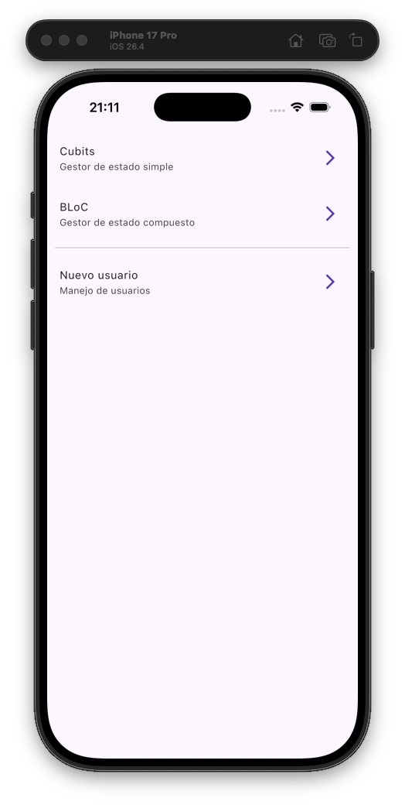
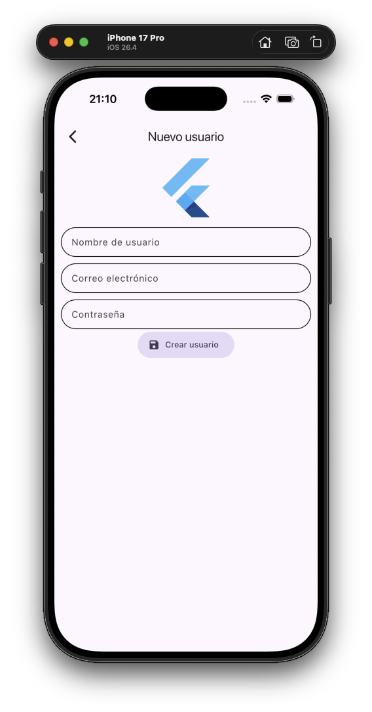

# Forms App

Aplicación de práctica creada con Flutter para comparar dos formas de gestionar el estado, `Cubit` y `BLoC`, usando el mismo ejemplo de contador implementado dos veces, y para aplicar después ese conocimiento a un caso más realista: un formulario de registro validado con `Cubit` y `formz`.

El objetivo principal no es construir una aplicación de producción, sino entender en qué se diferencian `Cubit` y `BLoC` en la práctica, y cómo la validación de un formulario se puede modelar como estado en lugar de repartirla entre los callbacks de los widgets.

## Demo

<p align="center">
  
  
</p>

<p align="center">
  <a href="https://youtube.com/shorts/Ny5g1VSRP3w?feature=share">Enlace al video demo</a>
</p>

## Tecnologías usadas

- Flutter con Material 3.
- Dart.
- `flutter_bloc` para la gestión de estado (`Cubit` y `Bloc`).
- `formz` para modelar la validación de los campos.
- `equatable` para comparar estados por valor.
- `go_router` para la navegación declarativa.

## Estructura del proyecto

```text
lib/
|-- config/
|   |-- router/
|   |   `-- app_router.dart
|   `-- theme/
|       `-- app_theme.dart
|-- infrastructure/
|   `-- inputs/
|       |-- email.dart
|       |-- inputs.dart
|       |-- password.dart
|       `-- username.dart
|-- presentation/
|   |-- blocs/
|   |   |-- counter_bloc/
|   |   |   |-- counter_bloc.dart
|   |   |   |-- counter_event.dart
|   |   |   `-- counter_state.dart
|   |   |-- counter_cubit/
|   |   |   |-- counter_cubit.dart
|   |   |   `-- counter_state.dart
|   |   `-- register/
|   |       |-- register_cubit.dart
|   |       `-- register_state.dart
|   |-- screens/
|   |   |-- block_counter_screen.dart
|   |   |-- cubit_counter_screen.dart
|   |   |-- home_screen.dart
|   |   |-- register_screen.dart
|   |   `-- screens.dart
|   `-- widgets/
|       |-- inputs/
|       |   `-- custom_text_form_field.dart
|       `-- widgets.dart
`-- main.dart
```

La app se organiza en tres áreas principales:

- `config`: configuración compartida de rutas y tema.
- `infrastructure/inputs`: clases de entrada de `formz` que encapsulan las reglas de validación.
- `presentation`: blocs/cubits, pantallas y widgets reutilizables.

## Punto de entrada

La aplicación arranca en `lib/main.dart`:

```dart
void main() {
  runApp(const MainApp());
}
```

`MainApp` construye un `MaterialApp.router` con:

- `routerConfig: appRouter` para conectar todas las rutas.
- `theme: AppTheme().getTheme()` para aplicar el tema de la app.
- `debugShowCheckedModeBanner: false` para ocultar el banner de debug.

## Navegación con GoRouter

La navegación se define en `lib/config/router/app_router.dart` usando `GoRouter`:

```dart
GoRoute(
  path: "/new-user",
  builder: (context, state) => const RegisterScreen()
)
```

Rutas disponibles:

| Ruta | Pantalla | Propósito |
| --- | --- | --- |
| `/` | `HomeScreen` | Pantalla principal |
| `/cubits` | `CubitCounterScreen` | Contador gestionado con `Cubit` |
| `/counter-bloc` | `BlockCounterScreen` | Contador gestionado con `BLoC` |
| `/new-user` | `RegisterScreen` | Formulario de registro validado con `Cubit` y `formz` |

## Tema

El tema se define en `lib/config/theme/app_theme.dart`. `AppTheme.getTheme()` devuelve un `ThemeData` de Material 3 generado a partir de un único color semilla:

```dart
ThemeData getTheme() {
  const seedColor = Colors.deepPurple;

  return ThemeData(
    useMaterial3: true,
    colorSchemeSeed: seedColor,
    listTileTheme: const ListTileThemeData(iconColor: seedColor),
  );
}
```

## Pantalla principal

`HomeScreen` (`lib/presentation/screens/home_screen.dart`) es un `ListView` con tres accesos que navegan con `context.push(...)`: `Cubits`, `BLoC` y `Nuevo usuario`, este último separado de los ejemplos de contador con un `Divider`.

## Cubit vs BLoC: el mismo contador dos veces

Las dos pantallas de contador manejan dos valores: el `counter` actual y un `transactionCount` que aumenta con cada pulsación pero no se reinicia al resetear el contador. Comparar ambas implementaciones en paralelo es el ejercicio central de esta parte de la app.

### Contador con Cubit

Archivos: `lib/presentation/blocs/counter_cubit/` y `lib/presentation/screens/cubit_counter_screen.dart`.

`CounterCubit` expone métodos normales que emiten un nuevo estado directamente:

```dart
class CounterCubit extends Cubit<CounterState> {
  CounterCubit() : super(const CounterState(counter: 0, transactionCount: 0));

  void intcreaseBy(int value) {
    emit(state.copyWith(
      counter: state.counter + value,
      transactionCount: state.transactionCount + 1,
    ));
  }

  void reset() {
    emit(state.copyWith(counter: 0));
  }
}
```

La UI llama a estos métodos directamente con `context.read<CounterCubit>().intcreaseBy(value)`. El título del `AppBar` usa `context.select` para que solo ese widget se reconstruya cuando cambia `transactionCount`:

```dart
title: context.select((CounterCubit value) {
  return Text('Cubit Counter: ${value.state.transactionCount}');
}),
```

El valor del contador se muestra con un `BlocBuilder<CounterCubit, CounterState>`.

### Contador con BLoC

Archivos: `lib/presentation/blocs/counter_bloc/` y `lib/presentation/screens/block_counter_screen.dart`.

`CounterBloc` reacciona a eventos en lugar de exponer métodos que modifican el estado directamente:

```dart
sealed class CounterEvent extends Equatable {
  const CounterEvent();
  @override
  List<Object> get props => [];
}

class CounterIncresed extends CounterEvent {
  final int value;
  const CounterIncresed({required this.value});
}

class CounterReset extends CounterEvent {}
```

```dart
class CounterBloc extends Bloc<CounterEvent, CounterState> {
  CounterBloc() : super(const CounterState()) {
    on<CounterIncresed>(_onCounterIncrease);
    on<CounterReset>(_onCounterReset);
  }

  void _onCounterIncrease(CounterIncresed event, Emitter<CounterState> emit) {
    emit(state.copyWith(
      counter: state.counter + event.value,
      transactionCount: state.transactionCount + 1,
    ));
  }
}
```

La UI despacha eventos en lugar de llamar a métodos:

```dart
context.read<CounterBloc>().add(CounterIncresed(value: value));
```

`CounterBloc` también mantiene un par de métodos de conveniencia (`increaseBy`, `resetCounter`) que internamente hacen `add` de los mismos eventos, mostrando que un `Bloc` puede seguir ofreciendo una API basada en métodos por encima de su núcleo dirigido por eventos si hace falta.

Tanto el título del `AppBar` como el valor del contador se leen con `context.select`, de modo que cada widget solo se reconstruye cuando cambia el campo concreto del que depende.

## Validación de formularios con Cubit y Formz

El flujo de registro (`/new-user`) muestra cómo modelar la validación de un formulario como estado usando `formz`, en lugar de validar los campos de forma imperativa dentro de los callbacks de los widgets.

### Clases de entrada

Archivos en `lib/infrastructure/inputs/`: `username.dart`, `email.dart`, `password.dart`.

Cada entrada extiende `FormzInput<String, ErrorType>` y define su propio enum de errores y sus reglas de validación. Por ejemplo, `Email`:

```dart
enum EmailError { empty, format }

class Email extends FormzInput<String, EmailError> {
  static final RegExp emailRegExp = RegExp(r'^[\w-\.]+@([\w-]+\.)+[\w-]{2,4}$');

  const Email.pure() : super.pure('');
  const Email.dirty(String value) : super.dirty(value);

  String? get errorMessage {
    if (isValid || isPure) return null;
    if (displayError == EmailError.empty) return 'El campo es requerido';
    if (displayError == EmailError.format) return 'No tiene formato de correo electrónico';
    return null;
  }

  @override
  EmailError? validator(String value) {
    if (value.trim().isEmpty) return EmailError.empty;
    if (!emailRegExp.hasMatch(value)) return EmailError.format;
    return null;
  }
}
```

`Username` y `Password` siguen el mismo patrón: `.pure()` para el campo aún no tocado, `.dirty(value)` para un campo con el que el usuario ya ha interactuado, un `validator` que devuelve el error correspondiente (o `null`), y un getter `errorMessage` que convierte ese error en texto solo cuando el campo está "dirty" y no es válido. Tanto `Username` como `Password` exigen un mínimo de 6 caracteres; `Password`, además, oculta el texto en la UI.

Las tres clases se re-exportan desde `lib/infrastructure/inputs/inputs.dart` como un único punto de importación.

### RegisterCubit y RegisterFormState

Archivos: `lib/presentation/blocs/register/register_cubit.dart` y `register_state.dart`.

`RegisterFormState` guarda una entrada de `formz` por campo, más un `formStatus` y un flag `isValid`:

```dart
enum FormStatus { invalid, valid, validating, posting }

class RegisterFormState extends Equatable {
  final FormStatus formStatus;
  final bool isValid;
  final Username username;
  final Email email;
  final Password password;
  ...
}
```

`RegisterCubit` expone un método `Changed` por campo. Cada uno crea una nueva entrada `.dirty`, revalida todos los campos con `Formz.validate` y emite el estado actualizado:

```dart
void emailChanged(String value) {
  final email = Email.dirty(value);

  emit(state.copyWith(
    email: email,
    isValid: Formz.validate([email, state.password, state.username]),
  ));
}
```

`onSubmit()` marca todos los campos como "dirty" (para que los errores de validación aparezcan también en los campos que el usuario nunca llegó a tocar) y recalcula `isValid` en un solo paso:

```dart
void onSubmit() {
  emit(state.copyWith(
    formStatus: FormStatus.validating,
    username: Username.dirty(state.username.value),
    password: Password.dirty(state.password.value),
    email: Email.dirty(state.email.value),
    isValid: Formz.validate([state.username, state.password, state.email]),
  ));
}
```

### RegisterScreen

Archivo: `lib/presentation/screens/register_screen.dart`.

`RegisterScreen` provee un `RegisterCubit` con `BlocProvider` y lo lee con `context.watch<RegisterCubit>()` dentro de `_RegisterFormnState`. Cada `CustomTextFormField` está conectado directamente al cubit:

```dart
CustomTextFormField(
  label: 'Correo electrónico',
  onChanged: registerCubit.emailChanged,
  errorMessage: email.errorMessage,
),
```

El `FilledButton.tonalIcon` de la parte inferior llama a `registerCubit.onSubmit()`. Como todos los campos escuchan el mismo cubit, escribir en uno de ellos puede activar o desactivar los mensajes de error de los demás, ya que `isValid` se recalcula con los valores de las tres entradas a la vez.

## Widget personalizado: CustomTextFormField

Archivo: `lib/presentation/widgets/inputs/custom_text_form_field.dart`.

Un envoltorio reutilizable de `TextFormField` usado por el formulario de registro. Centraliza el `OutlineInputBorder` redondeado, los colores de foco/error tomados del `ColorScheme` actual, y expone `label`, `hint`, `errorMessage`, `onChanged`, `validator` y `obscureText` como parámetros simples para que las pantallas no repitan el código de decoración.

## Conceptos de Flutter practicados

Esta app es útil para practicar:

- `Cubit` frente a `Bloc`: cambios de estado basados en métodos frente a cambios dirigidos por eventos.
- `BlocProvider`, `BlocBuilder`, `context.read`, `context.watch` y `context.select`.
- Reconstrucciones selectivas de widgets con `context.select` y `buildWhen` de `BlocBuilder`.
- `Equatable` para comparar estados por valor.
- `formz` para modelar la validación de campos como estado (`pure`/`dirty`, enums de error personalizados, `Formz.validate`).
- Componer varias entradas validadas en un único estado de formulario.
- Widgets de formulario reutilizables con `TextFormField`.
- Navegación con GoRouter.
- Tema Material 3 con `colorSchemeSeed`.

## Ejecutar el proyecto

Instalar dependencias:

```bash
flutter pub get
```

Ejecutar la aplicación:

```bash
flutter run
```

Analizar el código:

```bash
flutter analyze
```

Ejecutar tests, si se añaden tests al proyecto:

```bash
flutter test
```

## Resumen

`Forms App` es una aplicación de aprendizaje centrada en la gestión de estado y la validación de formularios. El ejemplo del contador está implementado dos veces, una con `Cubit` y otra con `BLoC`, para comparar sus APIs en paralelo, mientras que la pantalla de registro se apoya en ese mismo enfoque con `Cubit` para mostrar cómo `formz` puede convertir una validación de campos repartida en una única pieza de estado y testeable.

## Navegación

- [Volver a la descripción general del repositorio](../../README_es.md)
