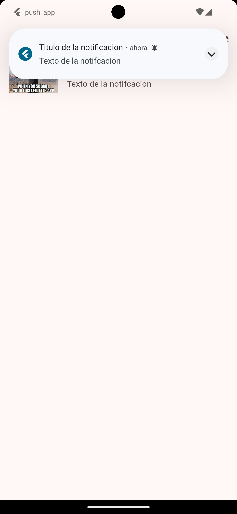
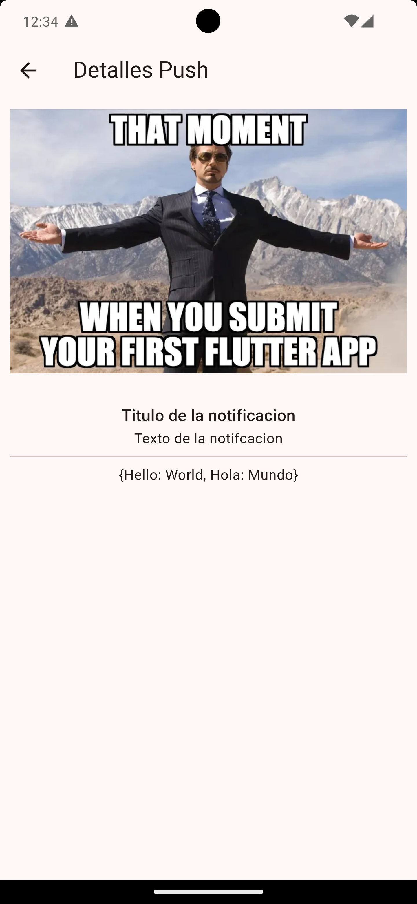

# Push App

A Flutter practice application built to receive push notifications sent from an external sender, in this case Firebase Cloud Messaging (FCM). The app asks the user for permission, gets the device token, listens for incoming messages in every app state (foreground, background or terminated), stores them in a list and lets the user open each one in a detail screen.

The main goal of this project is not to build a production application, but to understand the full lifecycle of a push notification in Flutter: setting up Firebase, handling permissions, reacting to messages depending on the app state, showing local notifications while the app is open, and navigating to the right screen when a notification is tapped.

## Demo

<p align="center">
  
  
</p>

## Platform Status

| Platform | Status |
| --- | --- |
| Android | Fully tested: permissions, foreground, background and terminated delivery, local notification with a custom sound, and navigation to the detail screen. |
| iOS | Code completed: `flutter_local_notifications` is configured for iOS (`DarwinInitializationSettings`, `DarwinNotificationDetails` and `AppDelegate`), and permissions are requested from both Firebase Messaging and the local notifications plugin. The app builds and runs on a physical device, but push delivery could not be tested end to end. Apple requires a paid Apple Developer account to set up APNs (Apple Push Notification service), which is the channel FCM uses to deliver messages on iOS. |

## Technologies

- Flutter with Material 3.
- Dart.
- `firebase_core` to initialize Firebase.
- `firebase_messaging` to receive push notifications from Firebase Cloud Messaging.
- `flutter_local_notifications` to show local notifications while the app is in the foreground.
- `flutter_bloc` for state management.
- `equatable` for value comparison in states and events.
- `go_router` for declarative navigation.

## Project Structure

```text
lib/
|-- config/
|   |-- local_notifications/
|   |   `-- local_notifications.dart
|   |-- presentation/
|   |   |-- blocs/
|   |   |   `-- notifications/
|   |   |       |-- notifications_bloc.dart
|   |   |       |-- notifications_event.dart
|   |   |       `-- notifications_state.dart
|   |   `-- screens/
|   |       |-- details_screen.dart
|   |       `-- home_screen.dart
|   |-- router/
|   |   `-- app_router.dart
|   `-- theme/
|       `-- app_theme.dart
|-- domain/
|   `-- entities/
|       `-- push_message.dart
|-- firebase_options.dart
`-- main.dart
```

The app is organized into these areas:

- `config/local_notifications`: a wrapper around `flutter_local_notifications`.
- `config/presentation`: the `NotificationsBloc` and the two app screens.
- `config/router` and `config/theme`: shared routes and theme.
- `domain/entities`: the `PushMessage` entity, independent from Firebase.
- `firebase_options.dart`: per-platform configuration generated by the FlutterFire CLI.

## Firebase Setup

The project was connected to Firebase with the FlutterFire CLI, which generated:

- `firebase.json`: a description of the apps registered in the Firebase project.
- `lib/firebase_options.dart`: `DefaultFirebaseOptions.currentPlatform` with the keys for each platform.
- `android/app/google-services.json` and `ios/Runner/GoogleService-Info.plist`: native configuration files.

On Android, the `com.google.gms.google-services` plugin is applied and `coreLibraryDesugaring` is enabled, which `flutter_local_notifications` requires. On iOS, the minimum platform version was raised to iOS 15.0 and `AppDelegate.swift` was adapted for `flutter_local_notifications` (see [iOS Setup](#ios-setup)).

## Entry Point

The application starts in `lib/main.dart`:

```dart
void main() async {
  WidgetsFlutterBinding.ensureInitialized();
  FirebaseMessaging.onBackgroundMessage(firebaseMessagingBackgroundHandler);

  await NotificationsBloc.initializeFirebaseNotifications();
  await LocalNotifications.initializeLocalNotifications();

  runApp(MultiBlocProvider(
    providers: [
      BlocProvider(
        create: (_) => NotificationsBloc(
          requestLocalNotificationPermissions: LocalNotifications.requestPermissionLocalNotifications,
          showLocalNotifications: LocalNotifications.showLocalNotifications,
        ),
      ),
    ],
    child: const MainApp(),
  ));
}
```

Before the UI starts, the background message handler is registered and Firebase is initialized. `NotificationsBloc` is provided at the root of the app so every screen can read the received notifications.

Local notifications are initialized on both Android and iOS before `runApp`, so the plugin is ready when the first foreground message arrives.

`MainApp` builds a `MaterialApp.router` and wraps all navigation with `HandleNotificationInteractions` through the `builder` property.

## Navigation with GoRouter

Navigation is defined in `lib/config/router/app_router.dart`:

```dart
GoRoute(
  path: '/push-details/:messageId',
  builder: (context, state) => DetailsScreen(
    pushMessageId: state.pathParameters['messageId'] ?? '4',
  ),
)
```

| Route | Screen | Purpose |
| --- | --- | --- |
| `/` | `HomeScreen` | Permission status and list of received notifications |
| `/push-details/:messageId` | `DetailsScreen` | Detail of a single notification |

`appRouter` is declared as a global variable so the app can also navigate from outside the widget tree, for example from the callback that runs when a local notification is tapped.

## Theme

`AppTheme.getTheme()` returns a Material 3 `ThemeData` generated from `Colors.red` as the seed color.

## PushMessage Entity

File: `lib/domain/entities/push_message.dart`.

`PushMessage` represents a notification inside the app, without depending on Firebase classes:

```dart
class PushMessage {
  final String messageId;
  final String title;
  final String body;
  final DateTime sentDate;
  final Map<String, dynamic>? data;
  final String? imageUrl;
  ...
}
```

Converting Firebase's `RemoteMessage` into an entity of its own keeps the UI independent from Firebase and lets it work only with the fields it needs.

## State Management with NotificationsBloc

Files: `lib/config/presentation/blocs/notifications/`.

### State and Events

`NotificationsState` stores the permission status and the list of received notifications:

```dart
class NotificationsState extends Equatable {
  final AuthorizationStatus status;
  final List<PushMessage> notifications;
  ...
}
```

There are two events:

- `NotificationsStatusChanged`: updates the notification authorization status.
- `NotificationReceived`: adds a new notification to the top of the list.

```dart
void _onPushMessageRecived(NotificationReceived event, Emitter<NotificationsState> emit) {
  emit(state.copyWith(
    notifications: [event.pushMessage, ...state.notifications],
  ));
}
```

### Permissions and FCM Token

When it is created, the bloc checks the current permission status with `messaging.getNotificationSettings()`. When the user taps the settings icon in the `AppBar`, `requestPermission()` is called, which asks Firebase Messaging for permission and also asks `flutter_local_notifications` (required on Android 13 and later):

```dart
NotificationSettings settings = await messaging.requestPermission(
  alert: true,
  badge: true,
  criticalAlert: true,
  sound: true,
  ...
);
```

When the status is `AuthorizationStatus.authorized`, the bloc gets the device FCM token with `messaging.getToken()` and prints it to the console. That token is what the Firebase console (or any other sender) uses to send test messages to that specific device.

### Receiving Messages

`handleRemoteMessage` turns a `RemoteMessage` into a `PushMessage`:

```dart
final notification = PushMessage(
  messageId: message.messageId?.replaceAll(':', '').replaceAll('%', '') ?? '',
  title: message.notification!.title ?? '',
  body: message.notification!.body ?? '',
  sentDate: message.sentTime ?? DateTime.now(),
  data: message.data,
  imageUrl: Platform.isAndroid
      ? message.notification!.android?.imageUrl
      : message.notification!.apple?.imageUrl,
);
```

The `:` and `%` characters are removed from `messageId` so it can be used as a parameter in the `/push-details/:messageId` route without breaking the URL. The image is read from the Android or Apple specific payload depending on the platform.

Then, if `showLocalNotifications` was injected, a local notification is shown, and a `NotificationReceived` event is added to the bloc.

### Injected Dependencies

`requestLocalNotificationPermissions` and `showLocalNotifications` are passed to the bloc through its constructor as optional functions instead of calling `LocalNotifications` directly. This way the bloc is not tightly coupled to the local notifications plugin and is easier to test or reuse.

## Messages by App State

| App state | How it is handled |
| --- | --- |
| Foreground | `FirebaseMessaging.onMessage.listen(handleRemoteMessage)` inside the bloc. The system does not show the notification on its own, so a local notification is triggered. |
| Background | The system shows the notification. When it is tapped, `FirebaseMessaging.onMessageOpenedApp` processes it and navigates to the detail screen. |
| Terminated | The system shows the notification. When the app is opened from it, `FirebaseMessaging.instance.getInitialMessage()` retrieves it and navigates to the detail screen. |

`firebaseMessagingBackgroundHandler` must be a top-level function because Firebase runs it in a separate isolate, outside the widget tree.

### HandleNotificationInteractions

This `StatefulWidget` in `lib/main.dart` sets up, in its `initState`, the two cases in which the user opens the app by tapping a notification:

```dart
Future<void> setupInteractedMessage() async {
  RemoteMessage? initialMessage =
      await FirebaseMessaging.instance.getInitialMessage();

  if (initialMessage != null) _handleMessage(initialMessage);

  FirebaseMessaging.onMessageOpenedApp.listen(_handleMessage);
}

void _handleMessage(RemoteMessage message) {
  context.read<NotificationsBloc>().handleRemoteMessage(message);

  final messageId = message.messageId?.replaceAll(':', '').replaceAll('%', '');
  appRouter.push('/push-details/$messageId');
}
```

The message is first registered in the bloc and then the app navigates to its detail, so `DetailsScreen` can find it by its id.

## Local Notifications

File: `lib/config/local_notifications/local_notifications.dart`.

`LocalNotifications` groups everything related to `flutter_local_notifications` into static methods:

- `requestPermissionLocalNotifications()`: requests notification permission on Android (`requestNotificationsPermission()`) and on iOS (`requestPermissions(alert: true, badge: true, sound: true)`).
- `initializeLocalNotifications()`: sets up the plugin with `AndroidInitializationSettings('app_icon')` and `DarwinInitializationSettings()`, and registers the callback that runs when a notification is tapped.
- `showLocalNotifications(...)`: shows the notification without blocking the caller (`unawaited`). On Android it uses maximum importance and a custom sound (`res/raw/notification.mp3`); on iOS it uses `DarwinNotificationDetails` with sound enabled.
- `onDidReceiveNotificationResponse(...)`: navigates to `/push-details/<payload>`, where the `payload` is the message `messageId`. If the payload is empty, it does nothing.

```dart
const notificationDetails = NotificationDetails(
  android: AndroidNotificationDetails(
    'channelId',
    'channelName',
    playSound: true,
    sound: RawResourceAndroidNotificationSound('notification'),
    importance: Importance.max,
    priority: Priority.high,
  ),
  iOS: DarwinNotificationDetails(presentSound: true),
);
```

### iOS Setup

File: `ios/Runner/AppDelegate.swift`.

For `flutter_local_notifications` to work on iOS, `AppDelegate` needs two extra steps before registering the plugins:

```swift
FlutterLocalNotificationsPlugin.setPluginRegistrantCallback { (registry) in
    GeneratedPluginRegistrant.register(with: registry)
}

if #available(iOS 10.0, *) {
  UNUserNotificationCenter.current().delegate = self as UNUserNotificationCenterDelegate
}
```

- `setPluginRegistrantCallback` registers the plugins in the isolate the plugin uses to handle notification actions.
- Assigning the `UNUserNotificationCenter` delegate lets iOS show notifications while the app is in the foreground and forward taps to the plugin.

## Screens

### HomeScreen

File: `lib/config/presentation/screens/home_screen.dart`.

- The `AppBar` title shows the current permission status using `context.select`, so it only rebuilds when `status` changes.
- The settings icon calls `requestPermission()` on the bloc.
- The body is a `ListView.builder` with the received notifications: title, body and image (if any). Tapping an item navigates to its detail.

### DetailsScreen

File: `lib/config/presentation/screens/details_screen.dart`.

It receives the `pushMessageId` from the route and looks up the message with `getMessageById`. If it exists, it shows the image, title, body and the contents of the `data` field; otherwise it shows the text `Notificación no existe` ("Notification does not exist").

## Sending a Test Notification

1. Run the app on an Android device and tap the settings icon to grant permissions.
2. Copy the FCM token printed in the debug console.
3. In the Firebase console, go to **Messaging** and create a new notification campaign.
4. Fill in the title, the text and, optionally, an image and additional key/value data.
5. Use **Send test message** and paste the device token.

The notification can be tested with the app in the foreground, in the background or terminated to check all three flows.

## Flutter Concepts Practiced

This app is useful for practicing:

- Integrating Firebase into a Flutter project with the FlutterFire CLI.
- Firebase Cloud Messaging: permissions, device token and message delivery.
- Differences between foreground, background and terminated messages.
- Top-level handlers for background messages.
- Local notifications with a custom channel, priority and sound.
- Navigating in response to a notification interaction.
- `Bloc` with events, immutable state and `Equatable`.
- Constructor dependency injection to decouple the bloc from plugins.
- Separating the domain entity (`PushMessage`) from the Firebase model (`RemoteMessage`).
- GoRouter routes with parameters and navigation outside the widget tree.
- Android and iOS specific native configuration (`build.gradle.kts`, `Podfile` and `AppDelegate.swift`).

## Running the Project

Install dependencies:

```bash
flutter pub get
```

Run the application:

```bash
flutter run
```

Analyze the code:

```bash
flutter analyze
```

Run tests, if tests are added to the project:

```bash
flutter test
```

To use your own Firebase project, regenerate the configuration with the FlutterFire CLI:

```bash
flutterfire configure
```

## Summary

`Push App` is a learning application focused on push notifications with Firebase Cloud Messaging. It covers the full journey of a message, from being sent in Firebase to being shown in the list and in its detail screen, with a `Bloc` as the single source of truth and local notifications for messages that arrive while the app is open. The Android side is fully tested; the iOS code is complete and the app runs on a physical device, but end-to-end push delivery is still pending until an Apple Developer account is available to set up APNs.

## Navigation

- [Back to the repository overview](../../README_en.md)
